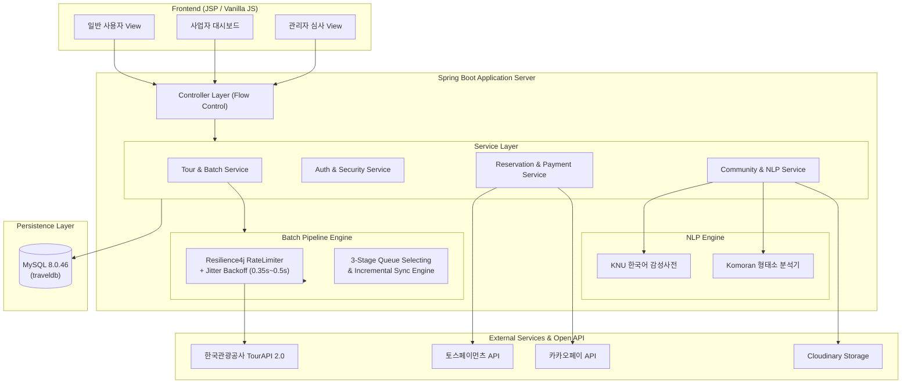

<p align="center">
  
</p>

<h1 align="center">갈래말래</h1>

<p align="center">
  <strong>공공데이터 기반 통합 여행 정보 및 원스톱 예약·커뮤니티 플랫폼</strong><br/>
  <sub>한국관광공사 TourAPI 연동, 지능형 배치 파이프라인, 예약·결제 라이프사이클, 후기 감성분석을 결합한 통합 여행 솔루션</sub>
</p>

<p align="center">
  
  
  
  
  
  
  
  
  
  
  
</p>

<p align="center">
  
  
  
  
</p>

---

## 🏷 배지 / 핵심 지표

### 서비스 배지

<p align="left">
  
  
  
  
  
</p>

### 기술 스택 배지

<p align="left">
  
  
  
  
  
  
  
  
</p>

---

## 📖 프로젝트 배경

여행지 탐색, 숙박·맛집 예약, 여행 후기 공유가 각각 다른 서비스에 흩어져 있어 정보가 분산되고 예약 과정이 번거로운 문제에서 출발했습니다.
**갈래말래**는 정보 탐색부터 결제, 커뮤니티 소통, 사업자 관리까지 하나의 플랫폼에서 연결하여 예약 중개 수수료와 지역 업체 제휴를 통한 비즈니스 모델을 확보하고, 소규모 지역 업소의 온라인 노출 기회를 넓히는 통합 여행 솔루션입니다.

1. **공공데이터 표준화 & 탐색 고도화**: 전국 관광지·숙박·맛집 데이터를 수집·정제하여 직관적인 UX 제공
2. **신뢰 기반 예약·결제 라이프사이클**: 만료 스케줄링, 결제 위변조 방지, 차등 환불 정책을 포함한 안전한 거래 환경
3. **방문자 인증 커뮤니티 & 사업자 분석**: 결제 검증 후기, 에디터 모듈, 사업자 대시보드 및 NLP 후기 감성분석 제공

---

## ✨ 차별화 포인트

- **지능형 큐 셀렉팅(Queue Selecting) 엔진**: 단순 필드 체크를 넘어 대표 이미지 4장 이상, 상세 소개, 이용요금을 연쇄 호출(Chain Call) 검증한 고품질 데이터 선별 적재
- **Resilience4j 트래픽 제어**: RateLimiter와 0.35~0.5초 Jitter 백오프 알고리즘을 결합하여 공공 API 429(Too Many Requests) 예외 선제 방어
- **스마트 증분 동기화(Incremental Sync)**: `modifiedtime` 기반 변동 데이터 및 폐업(`showflag=0`)을 감지하여 해당 지역만 핀포인트 1:1 수량 보충
- **원스톱 예약 라이프사이클**: 결제 대기 30분 자동 만료 스케줄러, 도메인별(숙박: 기간 겹침 방지 / 맛집·관광: 정원 관리) 동적 검증
- **규칙 기반 NLP 후기 감성분석**: Komoran 형태소 분석기와 KNU 한국어 감성사전을 매칭해 긍정/중립/부정 분류 및 워드클라우드 시각화

---

## 🎯 핵심 기능

### 1) 공공데이터 기반 여행 콘텐츠 및 스마트 필터링
- 시/도 및 시/군/구 단위 법정동 지역 필터 + 테마별(관광, 숙박, 맛집) 다차원 필터링
- 최신순 / 금액순 / 제목순 실시간 정렬 및 자동 해시태그 생성
- 갤러리 뷰 및 상세 이용안내(주차, 휴무일, 부대시설 등) 제공

### 2) 예약 & 멀티 PG 결제 시스템
- **통합 폼 분기**: 숙박(체크인~체크아웃 캘린더) / 맛집·관광지(방문일 정원 및 예약금 선결제) UI 자동 분기
- **멀티 PG 연동**: 카카오페이(서버 주도 통신) + 토스페이먼츠(프론트 위젯) 지원
- **보안 & 정합성**: 세션 금액 서버 재검증, 중복 콜백 방어, 멱등성 키(Idempotency Key) 적용 자동 환불

### 3) 커뮤니티 & 방문자 인증 후기
- 사진 2장 이상 시 슬라이더, 4장 선택 시 콜라주 컴포넌트 자동 생성 에디터
- 일반 후기(최대 5개 태그) 및 결제 검증 기반 방문자 인증 후기(1개 필수) 태깅 연동
- 사장님 전용 댓글 상단 고정 기능

### 4) 사업자(Business) 관리 대시보드
- 월별 매출 추이 및 예약 현황 이중 축 콤보 차트
- 후기 감성분석 요약 및 빈도 기반 키워드 워드클라우드
- 원터치 당일 즉시 마감 토글 & 캘린더 기반 휴무일 스케줄 관리

### 5) 회원/인증 & 관리자(Admin) 심사
- 로컬 로그인(BCrypt, 5회 실패 시 5분 잠금) 및 간편 소셜 로그인(구글, 카카오, 네이버)
- 이메일 인증번호 SHA-256 해시 검증 및 DB 트랜잭션 행 잠금
- 사업자 등록증 서류 열람 및 승인/반려 관리자 트랜잭션 처리

---

## 🏗 시스템 아키텍처



---

## 🛠 기술 스택

### Backend & Batch
| 기술 | 버전 / 용도 | 상세 설명 |
|:---|:---|:---|
| **Java** | 17 (OpenJDK) | 모던 자바 문법 및 Record, Stream API 활용 |
| **Spring Boot** | 3.5.16 | 핵심 웹 애플리케이션 프레임워크 및 의존성 주입 |
| **MyBatis** | 3.0.5 | SQL 매핑 기반 데이터베이스 영속성 제어 |
| **Resilience4j** | RateLimiter, Retry | 외부 API 초당 호출 제어 및 선제적 429 방어 |
| **Spring WebClient** | Reactive WebClient | 대용량 외부 공공 API 비동기/논블로킹 호출 |
| **Komoran & KNU** | 3.0 | 리뷰 텍스트 형태소 분석 및 긍·부정 감성 분류 |
| **Spring Security** |	Session Authentication |	SecurityContext 세션 저장, URL 접근 제어, CSRF 보호 |
| **Spring OAuth2 Client** |	Social Login |	Google·Kakao·Naver 소셜 로그인 |
| **BCrypt** |	Password & Verification Code |	비밀번호와 이메일 인증번호 단방향 해시 |
| **Spring Mail** |	SMTP |	회원가입·비밀번호 재설정·재활성화 인증번호 발송 |

### Frontend & Media
| 기술 | 버전 / 용도 | 상세 설명 |
|:---|:---|:---|
| **JSP / JSTL** | Jakarta 3.0.0 | 서버 사이드 템플릿 렌더링 및 공통 컴포넌트화 |
| **JavaScript** | ES6+ Modular | 에디터, 캘린더, 슬라이더 모듈 분리 설계 |
| **HTML5 / CSS3** | Standard | 반응형 카드 뷰 및 사이드바 레이아웃 구성 |
| **Cloudinary** | Image CDN | 업소 및 게시글 멀티 이미지 업로드/저장소 추상화 |

### Database & Infra
| 기술 | 버전 / 용도 | 상세 설명 |
|:---|:---|:---|
| **MySQL** | 8.0.46 | RDBMS 메인 스토리지 (외래키 CASCADE/무결성 보장) |
| **Git / GitHub** | VCS | 기능별 브랜치 전략 및 Pull Request 코드 리뷰 |

---

## 📁 프로젝트 구조

```text
com.gnagnoohc.travel
├── auth/                       # 회원가입, 로컬·소셜 인증, 계정 복구
│   ├── controller/             # 로그인, 회원가입, OAuth 성공·실패 흐름
│   ├── service/                # 로컬 인증, 이메일 인증, 소셜 계정 연동
│   ├── security/               # OAuth 인증 요청과 임시 인증 상태 관리
│   ├── mapper/                 # 회원·로컬 인증·소셜 인증 DB 접근
│   ├── dto/                    # 요청·응답 및 세션 인증 정보
│   └── model/
├── admin/                      # 관리자 사업자 인증 심사
│   ├── controller/             # 대시보드, 신청 조회, 승인·반려
│   ├── service/                # 관리자 재검증과 심사 상태 전이
│   ├── mapper/                 # 행 잠금과 조건부 상태 변경
│   └── dto/
├── batch/                      # 공공데이터 수집 및 동기화 배치 파이프라인
├── business/                   # 사업자 대시보드, 마감 관리, 업소 관리
├── common/                     # 공통 예외 처리, 유틸, 인터셉터
├── community/                  # 커뮤니티 게시판, 후기, 콜라주/슬라이더 에디터
├── config/                     # WebClientConfig, MyBatisConfig
│   └── SecurityConfig.java     # 세션, OAuth2, CSRF, URL 접근 정책
├── mypage/                     # 마이페이지 (회원정보, 찜목록, 예약내역)
├── reservation/                # 예약 생성, 상태 스케줄러, 결제(카카오/토스)
└── tour/                       # 여행/숙박/맛집 도메인, 검색, 필터링
```

---

## 📆 개발 일정

- **1주차 (기획·분석)**: 주제 선정, 요구사항 분석, DB 설계 (ERD), 역할 분담
- **2주차 (설계)**: 개발환경 세팅, DB 설계, UI/UX 설계
- **3주차 (핵심 개발)**: 회원/인증, 커뮤니티, 여행지·숙박·맛집, 예약·결제, 사업자 기능 구현 및 Git 병합(기능 통합)
- **4주차 (마무리)**: 통합 테스트 및 QA, 최종 발표 준비

---

## 🔌 주요 API 엔드포인트

| 도메인 | HTTP | 경로 | 설명 |
|:---|:---|:---|:---|
| **Auth** | `POST` | `/auth/login` | 일반 및 소셜 로그인 처리 (BCrypt 해시 검증) |
| **Auth** | `POST` | `/auth/email/send` | 이메일 인증번호 발송 및 해시 검증 |
| **Admin** | `POST` | `/admin/business/review` | 관리자 사업자 인증 서류 심사 (승인/반려 트랜잭션) |
| **Tour** | `GET` | `/tour/list` | 카테고리(관광·숙박·맛집) 및 지역별 장소 목록 조회 |
| **Tour** | `GET` | `/tour/detail` | 장소 상세 정보 및 연쇄 수집 이미지 조회 |
| **Reservation** | `POST` | `/reservations/new` | 숙박(기간 겹침) / 맛집·관광지(정원) 검증 기반 예약 생성 |
| **Payment** | `POST` | `/payment/kakao/approve` | 카카오페이 결제 승인 및 금액 재검증 |
| **Payment** | `POST` | `/payment/toss/confirm` | 토스페이먼츠 결제 승인 연동 |
| **Community** | `POST` | `/community/posts` | 게시글 작성 (콜라주/슬라이더 에디터, 장소 태그) |
| **Business** | `GET` | `/business/dashboard` | 사업자 매출 현황 대시보드 및 리뷰 감성분석·워드클라우드 |
| **Business** | `POST` | `/business/places/close` | 당일 즉시 예약 마감 및 캘린더 휴무일 스케줄 관리 |

---

## 🧩 트러블슈팅 하이라이트

### 1. 여행 콘텐츠 - 외부 API 429(Rate Limit) 예외 대응
- **문제**: 고품질 데이터 선별을 위해 상세 이미지, 소개정보(DetailIntro), 객실/가격정보(DetailInfo) 등을 연쇄 호출(Chain Call)하면서 공공데이터 API 초당 호출 한도를 초과해 배치가 중단되는 429 에러 발생.
- **원인**: 고속 연쇄 호출 시 고정 지연(Fixed Delay) 방식만으로는 특정 시점에 트래픽이 동시다발적으로 몰리는 병목 현상(Thundering Herd Problem)을 방지하지 못함.
- **해결**: `Resilience4j RateLimiter`를 도입하여 시스템 수준에서 초당 요청 건수를 제어하고, 무작위 오차 변수인 **Jitter를 부여해 0.35초~0.5초 사이의 동적 지연**을 적용함으로써 트래픽 스파이크를 분산하고 429 예외를 선제 차단.

### 2. 마이페이지 - 비밀번호 불일치 시 회원탈퇴 예외 처리 단일화
- **문제**: 일반 사용자가 비밀번호가 맞지 않아도 회원탈퇴가 진행되거나, 사업자 마이페이지에서 비밀번호 불일치 시 탈퇴는 안 되나 강제 로그아웃되는 문제 발생.
- **원인**: 일반 사용자와 사업자의 회원탈퇴 로직이 분리되어 작성되었고, 비밀번호 재검증 로직이 누락됨.
- **해결**: 회원탈퇴 검증 로직을 통일하여 비밀번호가 일치할 때만 탈퇴가 진행되도록 수정하고, 최종 탈퇴 의사 재확인 모달을 추가하여 예외 흐름 방어.

### 3. Git - 로컬 전역 병합 정책 불일치로 인한 브랜치 추적 이탈 해결
- **문제**: GitHub PR 처리 후 로컬에서 `git pull` 시 리모트 트래킹 브랜치 추적 연동이 이탈하는 현상 발생.
- **원인**: 로컬 `.gitconfig`의 전역 병합 설정과 GitHub PR Merge 전략 간의 차이로 인해 로컬 커밋 트리와 원격 커밋 트리가 어긋남.
- **해결**: 팀 내 Local/Global Git Config의 병합 정책을 정리하고, GitHub repository의 PR Merge Strategy를 명확히 규격화하여 해결.

---

## 👥 팀원 및 역할 분담

|                     이름                      | 담당 파트 | 담당 상세 업무 |
|:-------------------------------------------:|:---:|:---|
|  [**김동주**](https://github.com/eastmarble)   | **회원 / 인증 / 관리자** | • Auth 패키지 (로컬·소셜 로그인, 회원가입, 이메일 인증, 계정 찾기)<br/>• Admin 패키지 (사업자 인증 신청 조회, 서류 열람)<br/>• 승인·반려 처리 및 사업자 권한 부여 트랜잭션 |
|   [**김윤정**](https://github.com/beautiyj)    | **여행 콘텐츠 / 배치** | • 여행 콘텐츠 페이지 총괄 구현 및 한국관광공사 TourAPI 연동<br/>• 3단계 큐 셀렉팅 엔진 및 Resilience4j 트래픽 제어 파이프라인 구축<br/>• 증분 동기화(Incremental Sync) 스케줄러 및 브랜치 관리·병합 총괄 |
|   [**김태희**](https://github.com/Cloud-bb)    | **사업자 / 감성분석** | • 사업자 전용 관리자 대시보드 (KPI 통계, 매출 콤보 차트)<br/>• Komoran & KNU 감성사전 기반 후기 긍/부정 분석 및 워드클라우드<br/>• 업소 정보 등록/수정, 사업자 등록인증 및 마감 관리 |
| [**송우진**](https://github.com/real-raindrop) | **예약 / 결제** | • 숙박/맛집/관광지 맞춤형 예약 폼 및 예약 기능 총괄 개발<br/>• 카카오페이 연동 및 PaymentGateway 설계<br/>• 결제 만료 스케줄러 및 멱등성 환불 로직 |
|    [**이다희**](https://github.com/log-dh)     | **커뮤니티 / 토스결제** | • 게시판 페이지 구현 및 댓글/대댓글 기능<br/>• 본문 단일 이미지 / 콜라주 / 슬라이더 자동 생성 기능<br/>• 토스페이먼츠 연동 기능 |
| [**장철순**](https://github.com/jangcheolsun)  | **마이페이지** | • 마이페이지 UI 및 회원정보 관리<br/>• 찜 목록 / 예약 목록 관리 및 회원 탈퇴·로그아웃 |
